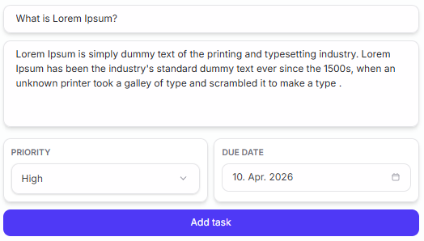
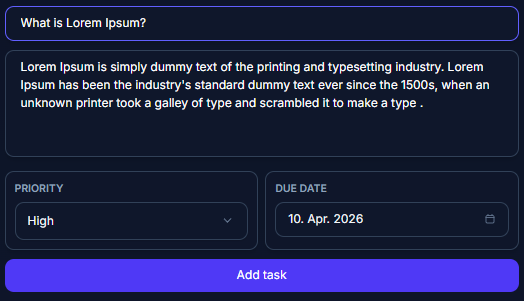
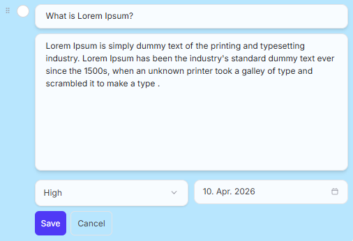
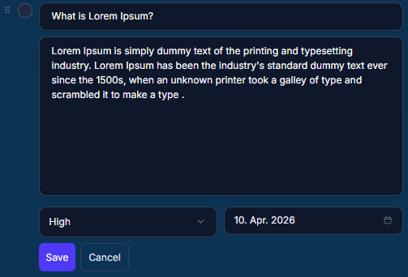

# 📝 Taskify – Fullstack Todo App

## 🚀 Live Demo

Frontend: https://taskify-three-cyan.vercel.app/
Backend: https://taskify-api-knxa.onrender.com/api/todos

---

A modern fullstack Todo application with advanced UX features such as drag & drop, real-time editing, filtering, and smooth animations.

---

## ✨ Features

- ✅ Add, edit, delete tasks
- 🎯 Priority system (Low, Medium, High)
- 📅 Due dates with status (Overdue, Today, Tomorrow)
- 🔍 Search tasks
- 🧩 Filter (All, Active, Completed)
- 🔄 Sorting (Manual, Newest, Oldest, Priority, Due date)
- 🖱 Drag & drop reordering
- 🌙 Dark / Light mode
- 🔔 Toast notifications
- ⚠️ Error handling with retry system
- ⏳ Loading states + Skeleton UI
- 🧹 Clear completed tasks with animation

---

## 🛠 Tech Stack

### Frontend

- React (Vite)
- Tailwind CSS

### Backend

- Node.js
- Express
- JSON file database (`db.json`)

---

## 📦 Installation

### 1. Clone the repository

```bash
git clone https://github.com/eljakj/taskify.git
cd taskify
```

---

### 2. Install dependencies

#### Frontend

```bash
cd client
npm install
```

#### Backend

```bash
cd server
npm install
```

---

## ▶️ Run the app

### Start backend

```bash
cd server
node server.js
```

Backend runs on:

```
http://localhost:5000
```

---

### Start frontend

```bash
cd client
npm run dev
```

Frontend runs on:

```
http://localhost:5173
```

---

## 📸 Screenshots

### 🌞 Light Mode


### 🌙 Dark Mode


### ➕ Add Task Light



### ➕ Add Task Dark



### ✏️ Edit Task Light



### ✏️ Edit Task Dark



---

## 📁 Project Structure

```
client/
 ├── src/
 ├── public/
 ├── package.json

server/
 ├── server.js
 ├── db.json
 ├── package.json
```

---

## ⚡ Future Improvements

- User authentication
- Database integration (MongoDB / PostgreSQL)
- Task categories / tags
- Notifications / reminders
- Mobile optimization

---

## 👨‍💻 Author

Jad El Jakhlab
GitHub: https://github.com/eljakj
