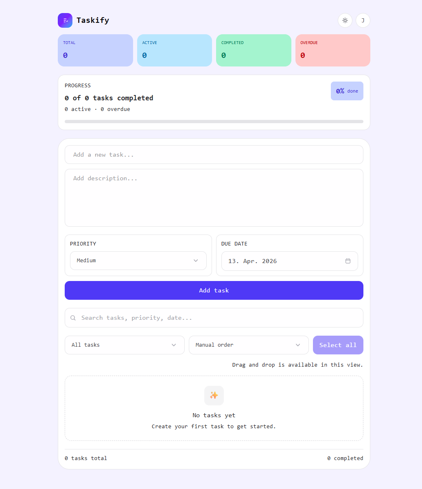
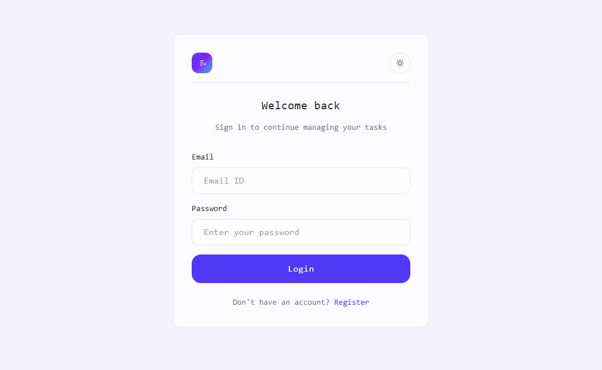
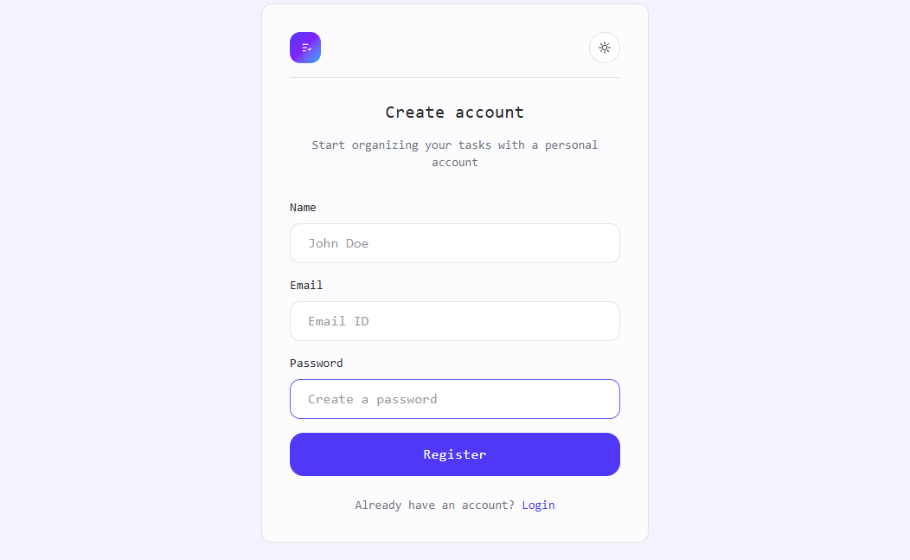
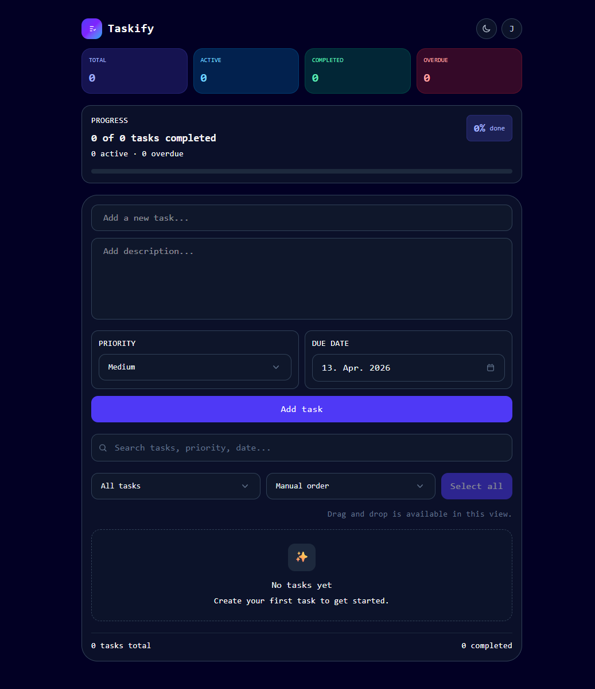
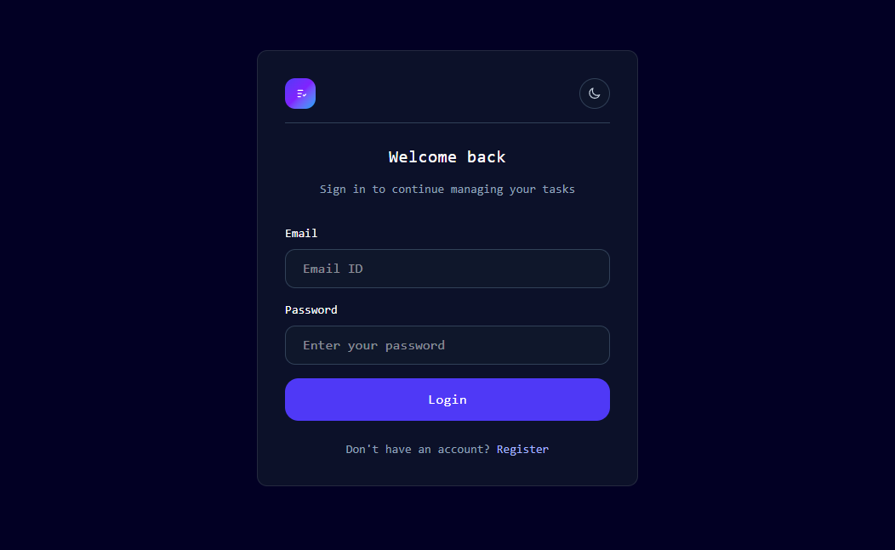
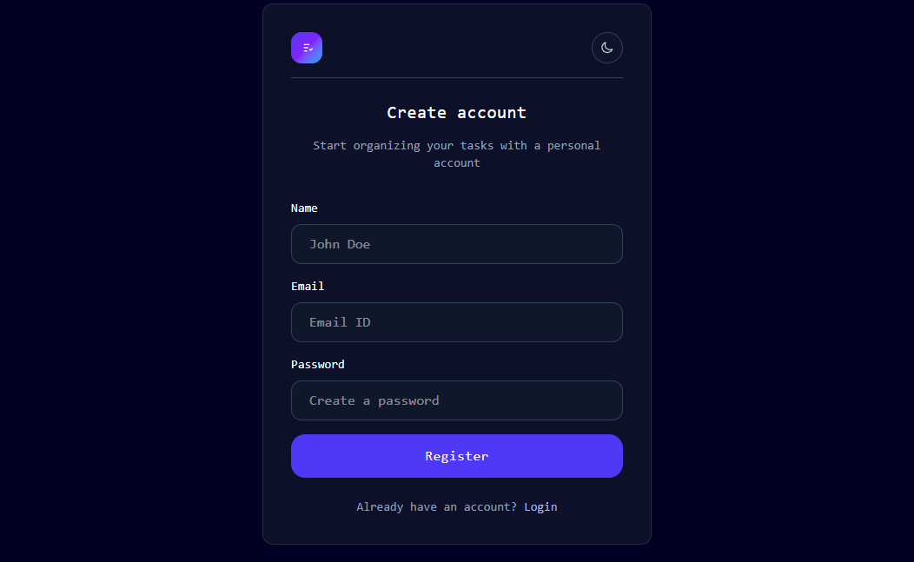

# 📝 Taskify

A modern fullstack task management app with a clean UI, smooth UX, and powerful features like drag & drop, filtering, and real-time search.

Built to demonstrate fullstack architecture, authentication, and responsive design.

---

## 🚀 Live Demo

- 👉 Frontend: https://taskify-three-cyan.vercel.app/
- 👉 API: https://taskify-api-knxa.onrender.com

You can create your own account to explore the app.

---

## ✨ Features

### 🧩 Task Management

- Add, edit, delete tasks
- Drag & drop reordering
- Clear completed tasks with animation

### 📅 Organization

- Priority system (Low, Medium, High)
- Due dates with smart status (Overdue, Today, Tomorrow)
- Filtering (All, Active, Completed)
- Advanced sorting (Manual, Newest, Oldest, Priority, Due date)

### 🔍 UX & UI

- Real-time search
- Dark / Light mode
- Toast notifications
- Loading states + Skeleton UI
- Error handling with retry system

### 🔐 Authentication

- JWT-based authentication
- User-specific todos
- Protected API routes

---

## 📱 Responsive Design

- Mobile-first layout
- Optimized for iOS & Android
- Native date picker support
- Full-height layout (no white edges on mobile)

---

## 🛠 Tech Stack

### Frontend

- React (Vite)
- Tailwind CSS

### Backend

- Node.js
- Express
- MongoDB Atlas
- Mongoose

### Auth & Security

- JWT
- bcryptjs

---

## ⚙️ Environment Variables

Create a `.env` file inside the `server` folder:

```env
PORT=5000
MONGODB_URI=your_mongodb_connection_string
JWT_SECRET=your_super_secret_key
```

Create a `.env` file inside the `client` folder:

```env
VITE_API_URL=http://localhost:5000
```

---

## 📦 Installation

### 1. Clone the repository

```bash
git clone https://github.com/eljakj/taskify.git
cd taskify
```

### 2. Install dependencies

#### Frontend

```bash
cd client
npm install
```

#### Backend

```bash
cd server
npm install
```

---

## ▶️ Run the app

### Start backend

```bash
cd server
node server.js
```

Backend runs on:

```
http://localhost:5000
```

### Start frontend

```bash
cd client
npm run dev
```

Frontend runs on:

```
http://localhost:5173
```

---

## 📸 Screenshots

### 🌞 Light Mode








### 🌙 Dark Mode








---

## 📁 Project Structure

```
client/
 ├── src/
 ├── public/
 └── package.json

server/
 ├── server.js
 ├── routes/
 ├── models/
 └── package.json
```

---

## ⚡ Future Improvements

- 🗂 Task categories / tags
- 🔔 Notifications / reminders
- 📊 Analytics dashboard
- 🎨 User-specific themes
- 📱 PWA support

---

## 🔗 API Endpoints

### Auth

- POST /api/auth/register
- POST /api/auth/login
- GET /api/auth/me

### Todos

- GET /api/todos
- POST /api/todos
- PUT /api/todos/:id
- DELETE /api/todos/:id

---

## 👨‍💻 Author

**Jad El Jakhlab**
GitHub: https://github.com/eljakj

---

Made with ❤️
